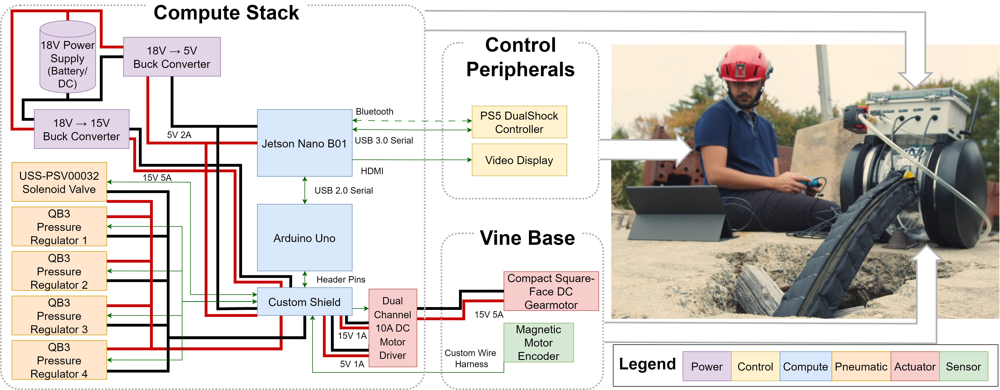

# Documentation

## Overview
This document provides build documentation for SPROUT: The Open-Source Soft Robot for Search and Rescue, covering two subsystems:

- **Compute box** — onboard computation, power regulation, actuator control, sensing interfaces, networking, and embedded communication hardware. See `bom.md`, `enclosure.md`, `assembly.md`, and `wiring.md`.
- **Vine robot body** — the soft, pneumatically-actuated "vine" that everts from the base and is driven by the compute box. See `vine.md`.

The system is designed for:
- field deployment,
- modular servicing,
- battery-powered operation,
- rapid hardware iteration,
- reproducible research integration.

---

## Documentation Map

| Section | Description |
|---|---|
| `bom.md` | Bill of materials and sourcing |
| `enclosure.md` | Enclosure preparation and mounting layout |
| `assembly.md` | Step-by-step assembly procedure |
| `wiring.md` | Wiring harnesses and connector pinouts |
| `vine.md` | Fabricating the vine robot body |

---

## Compute Box

### System Architecture



The compute stack coordinates communication between:
- embedded microcontrollers,
- motor drivers,
- sensing hardware,
- pneumatic regulators,
- operator interfaces,
- power regulation hardware.

Major subsystems include:
- Compute Stack
- Control Peripherals
- Vine Base

### Compute Hardware

Current compute hardware includes:

| Component | Function |
|---|---|
| NVIDIA Jetson | Main onboard compute |
| Arduino Uno Rev3 | Low-level actuator/sensor interface |
| DC-DC regulators | Power conversion |
| Motor drivers | Actuator control |

### Power Architecture

The compute box operates from an external DC battery source.

Primary voltage rails:
- 18 V actuator rail
- 15 V auxiliary rail
- 5 V compute rail

All rails are fused independently.

### Communication Architecture

The system currently uses:
- USB serial communication
- Ethernet 
- WiFi

### Assembly Workflow

Recommended assembly order:

1. Mechanical enclosure preparation
2. Component mounting
3. Power subsystem wiring
4. Compute subsystem installation
5. Peripheral wiring
6. Software flashing/setup
7. Validation testing

### Safety

> Disconnect all power before servicing the compute box.

> Verify voltage polarity prior to powering up the system.

> Use strain relief for all external cable interfaces.

---

## Vine Robot Body

The vine body is a soft, pneumatically-actuated structure fabricated from heat-sealable TPU-coated fabric — see `vine.md` for the full fabrication procedure, materials, and inspection/test steps.

> Overheating the impulse sealer during fabrication can ruin hours of work in seconds; underheating can produce a body that bursts at low actuation pressures.

---

## Repository Structure

```text
SPROUT_Design/
├── CAD/
├── Code/
├── Documentation/
│   ├── index.md
│   ├── bom.md
│   ├── enclosure.md
│   ├── assembly.md
│   ├── wiring.md
│   ├── vine.md
│   └── Images/
└── Electronics/
```